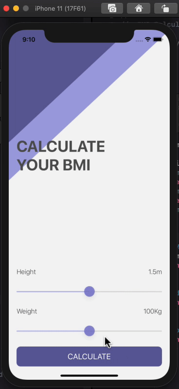

#  BMI Calculator

## Goal
1. BMI 계산 프로그램
2. 사용자는 2개의 Slider를 통해 자신의 키와 체중을 설정할 수 있다.
3. 2개의 슬라이더 우측 상단의 Label을 통해 설정된 수치를 확인할 수 있다.
4. Calculate 버튼을 누르면 새로운 ViewController가 생성된다.
5. 새로 생성된 결과창에는 사용자가 설정한 키와 체중으로 계산된 BMI 수치가 나온다.
6. BMI의 수치에 따라 낮음 / 적절 / 높음 3가지 옵션이 결정됨
7. 결정된 등급에 따라 배경화면과 BMI 아래의 문구가 변경됨
8. Recalculate 버튼을 누르면 다시 메인 화면으로 돌아감

## Optional Value
1. Force Unwrapping

```
var optional: String?
optional = nil
print(optional!) // Runtime Error
```

2. Check for nil value

```
if optional != nil {
    optional!
} else {
    print("optional value is nil")
```

3. Optional Binding

```
if let safeOptional = optional {
    safeOptional
} else {
    print("optional value is nil")
```

4. Nil Coalescing Operator

```
myOptional = nil
let text: String = myOptional ?? "I am the default value"
print(text)
```

5. Optional Chaining

```
struct MyOptional {
    var property = 123
    
    func method() {
        print("I am the struct's method.")
    }
}

let myOptional: MyOptional?
myOptional = MyOptional()

print(myOptional?.property)
myOptional?.method()
```

## 실행 화면

